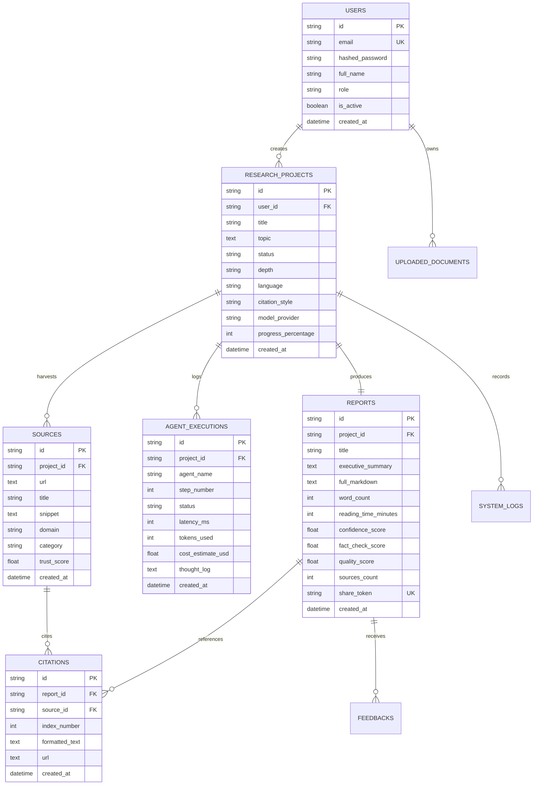

# Database Schema & Entity Relationships

The relational data model is managed via asynchronous SQLAlchemy 2.0 with PostgreSQL in production and SQLite async for zero-dependency local runs.

```mermaid
erDiagram
    USERS ||--o{ RESEARCH_PROJECTS : creates
    USERS ||--o{ UPLOADED_DOCUMENTS : owns
    RESEARCH_PROJECTS ||--|| REPORTS : produces
    RESEARCH_PROJECTS ||--o{ AGENT_EXECUTIONS : logs
    RESEARCH_PROJECTS ||--o{ SOURCES : harvests
    RESEARCH_PROJECTS ||--o{ SYSTEM_LOGS : records
    REPORTS ||--o{ CITATIONS : references
    REPORTS ||--o{ FEEDBACKS : receives
    SOURCES ||--o{ CITATIONS : cites

    USERS {
        string id PK
        string email UK
        string hashed_password
        string full_name
        string role
        boolean is_active
        datetime created_at
    }

    RESEARCH_PROJECTS {
        string id PK
        string user_id FK
        string title
        text topic
        string status
        string depth
        string language
        string citation_style
        string model_provider
        int progress_percentage
        datetime created_at
    }

    REPORTS {
        string id PK
        string project_id FK
        string title
        text executive_summary
        text full_markdown
        int word_count
        int reading_time_minutes
        float confidence_score
        float fact_check_score
        float quality_score
        int sources_count
        string share_token UK
        datetime created_at
    }

    AGENT_EXECUTIONS {
        string id PK
        string project_id FK
        string agent_name
        int step_number
        string status
        int latency_ms
        int tokens_used
        float cost_estimate_usd
        text thought_log
        datetime created_at
    }

    SOURCES {
        string id PK
        string project_id FK
        text url
        string title
        text snippet
        string domain
        string category
        float trust_score
        datetime created_at
    }

    CITATIONS {
        string id PK
        string report_id FK
        string source_id FK
        int index_number
        text formatted_text
        text url
        datetime created_at
    }
```
