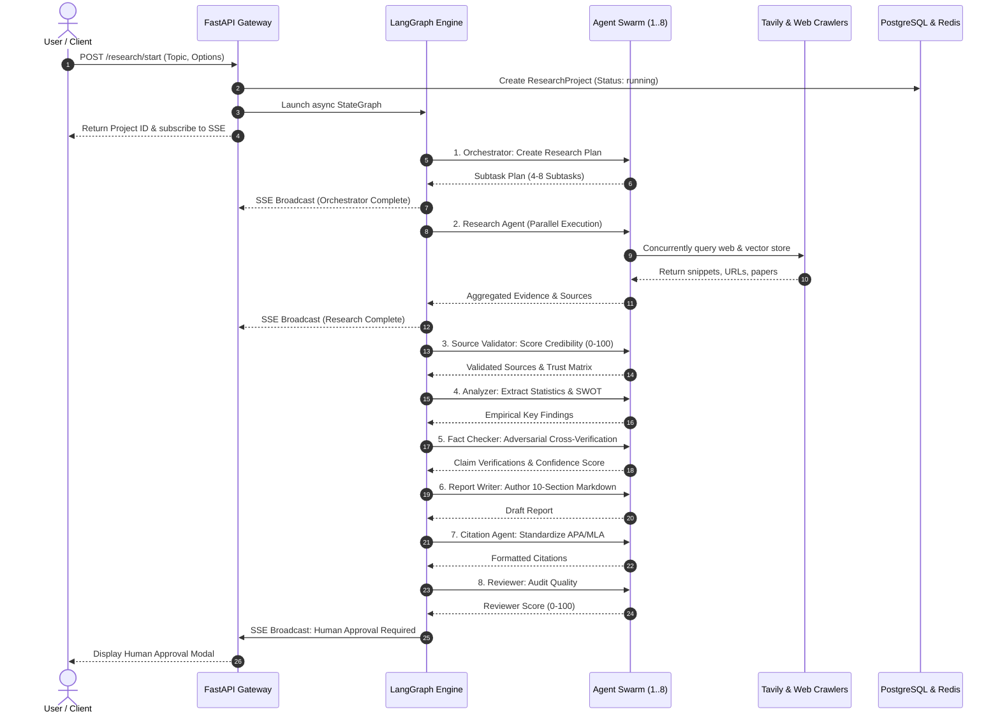
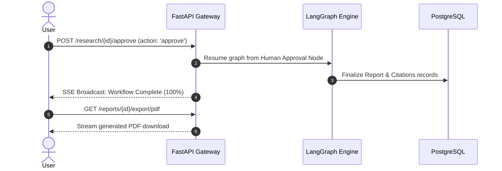

# System Sequence Diagrams

## 1. End-to-End Multi-Agent Research Execution

```mermaid
sequenceDiagram
    autonumber
    actor User as User / Client
    participant API as FastAPI Gateway
    participant Runner as LangGraph Engine
    participant Agents as Agent Swarm (1..8)
    participant Search as Tavily & Web Crawlers
    participant DB as PostgreSQL & Redis

    User->>API: POST /research/start (Topic, Options)
    API->>DB: Create ResearchProject (Status: running)
    API->>Runner: Launch async StateGraph
    API-->>User: Return Project ID & subscribe to SSE

    Runner->>Agents: 1. Orchestrator: Create Research Plan
    Agents-->>Runner: Subtask Plan (4-8 Subtasks)
    Runner-->>API: SSE Broadcast (Orchestrator Complete)

    Runner->>Agents: 2. Research Agent (Parallel Execution)
    Agents->>Search: Concurrently query web & vector store
    Search-->>Agents: Return snippets, URLs, papers
    Agents-->>Runner: Aggregated Evidence & Sources
    Runner-->>API: SSE Broadcast (Research Complete)

    Runner->>Agents: 3. Source Validator: Score Credibility (0-100)
    Agents-->>Runner: Validated Sources & Trust Matrix

    Runner->>Agents: 4. Analyzer: Extract Statistics & SWOT
    Agents-->>Runner: Empirical Key Findings

    Runner->>Agents: 5. Fact Checker: Adversarial Cross-Verification
    Agents-->>Runner: Claim Verifications & Confidence Score

    Runner->>Agents: 6. Report Writer: Author 10-Section Markdown
    Agents-->>Runner: Draft Report

    Runner->>Agents: 7. Citation Agent: Standardize APA/MLA
    Agents-->>Runner: Formatted Citations

    Runner->>Agents: 8. Reviewer: Audit Quality
    Agents-->>Runner: Reviewer Score (0-100)

    Runner->>API: SSE Broadcast: Human Approval Required
    API-->>User: Display Human Approval Modal
```

---

## 2. Human Approval & Publication Sequence

```mermaid
sequenceDiagram
    autonumber
    actor User as User
    participant API as FastAPI Gateway
    participant Runner as LangGraph Engine
    participant DB as PostgreSQL

    User->>API: POST /research/{id}/approve (action: 'approve')
    API->>Runner: Resume graph from Human Approval Node
    Runner->>DB: Finalize Report & Citations records
    API-->>User: SSE Broadcast: Workflow Complete (100%)
    User->>API: GET /reports/{id}/export/pdf
    API-->>User: Stream generated PDF download
```
